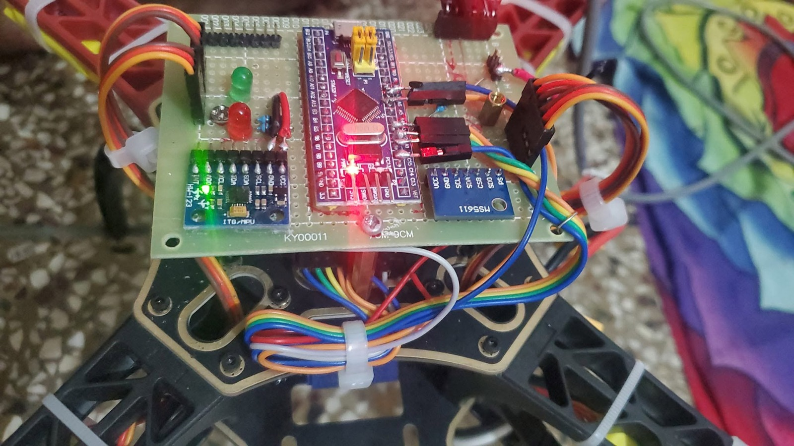
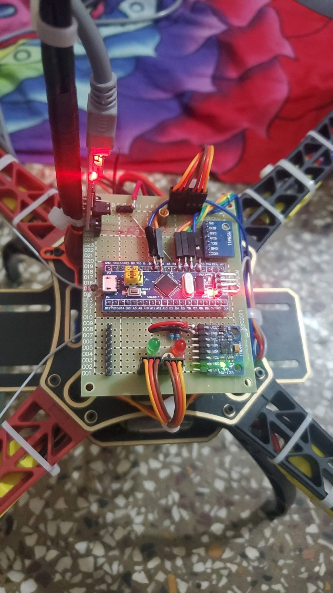
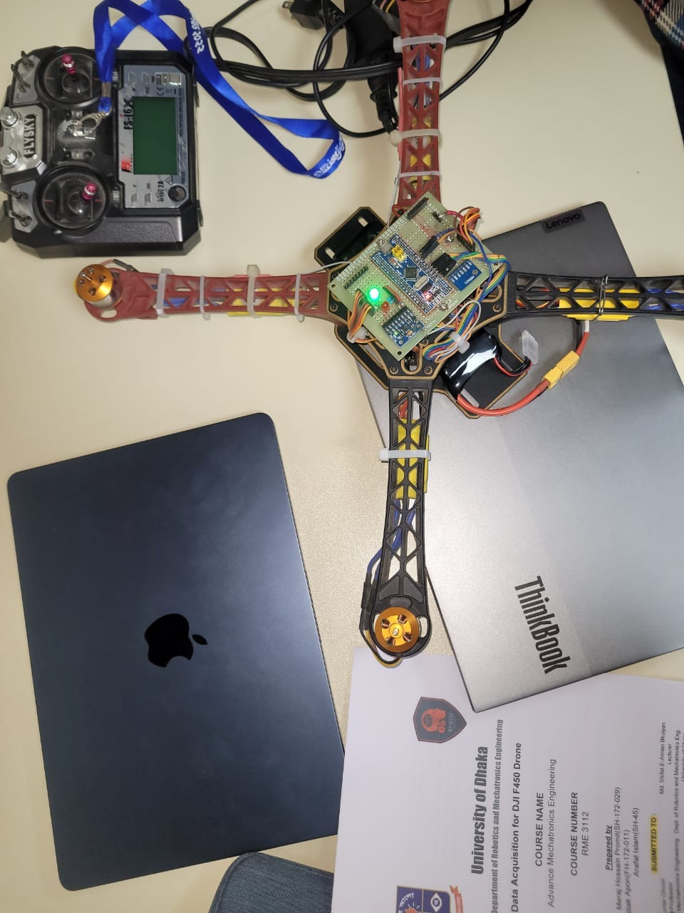
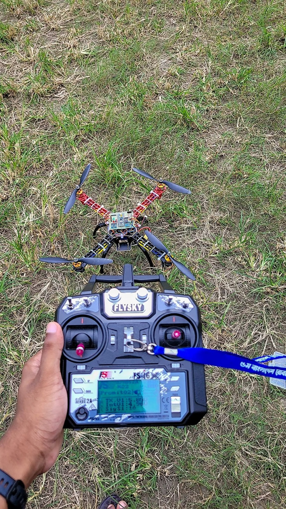
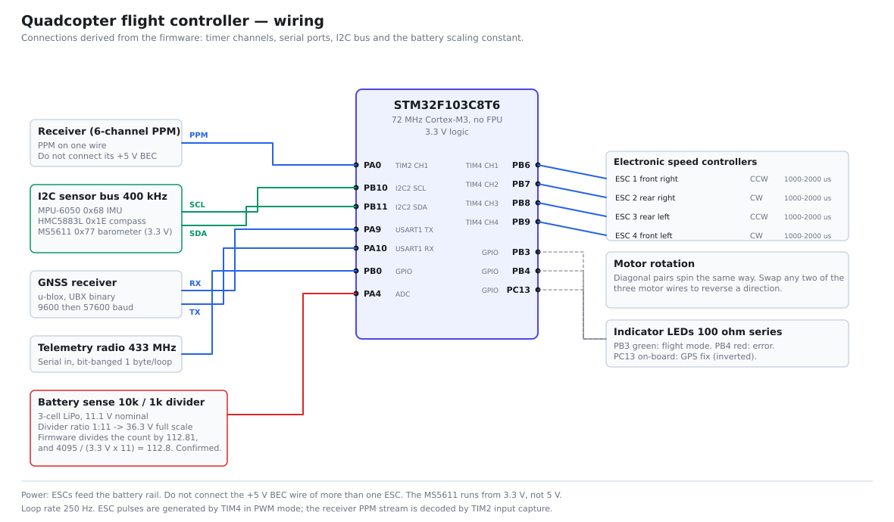

# STM32 Autonomous Quadcopter Flight Controller

A bare-metal flight controller for a quadcopter, running a **250 Hz** control
loop on an STM32F103C8T6 (Cortex-M3, 72 MHz, no FPU). It fuses a gyroscope,
accelerometer, magnetometer, barometer and GPS into an attitude and position
estimate, and closes six control loops around it: three rate loops, an
attitude cascade, altitude hold, and GPS position hold.

No flight stack, no RTOS, no libraries beyond `Wire` and `EEPROM`. Every
transform, filter and controller here is written out explicitly, which is why
this document can state exactly what the aircraft computes on each of its
250 loops per second.

<p align="center">
  
</p>

<p align="center">
  <em>Take-off under its own control.
  Full 18 s flight: <a href="media/test_flight_540p.mp4">test_flight_540p.mp4</a></em>
</p>

<p align="center">
  
</p>

<p align="center">
  
  
  
</p>

<p align="center">
  <em>Hand-soldered on perfboard: STM32 board, MPU-6050, MS5611, HMC5883L,
  GPS and the 433 MHz telemetry radio, wired to four ESCs.</em>
</p>

---

## Hardware

| Part | Device | Interface |
| --- | --- | --- |
| MCU | STM32F103C8T6, 72 MHz Cortex-M3, 20 KB RAM, no FPU | — |
| IMU | MPU-6050, gyro ±500 °/s and accelerometer ±8 g | I²C1 @ 400 kHz |
| Magnetometer | HMC5883L | I²C1 @ 400 kHz |
| Barometer | MS5611, 24-bit pressure and temperature | I²C1 @ 400 kHz |
| GNSS | u-blox, UBX binary at 57 600 baud, 5 Hz | USART1 |
| Telemetry | 433 MHz link to a ground receiver | bit-banged, 1 byte/loop |
| Receiver | 6-channel PWM, captured by timer input capture | TIM2 |
| Motors | 4 × ESC, 1000–2000 µs pulses at 250 Hz | TIM4 PWM |

The absence of an FPU is the single most important fact about this target.
Every `float` operation is a software routine, so the loop budget below is
dominated by arithmetic that would be free on an F4.

---

## Control architecture

One loop, 4000 µs, no scheduler. The order matters: sensors are read first,
the estimate is updated, controllers run on that estimate, and the motor
pulses are written last so they are as fresh as possible.

```
   ┌─ 250 Hz, Δt = 4 ms ─────────────────────────────────────────────┐
   │  read IMU ─ barometer ─ compass ─ GPS                           │
   │        ↓                                                        │
   │  attitude estimate  (complementary filter, §2)                  │
   │        ↓                                                        │
   │  altitude hold (§5) ── GPS position hold (§6) ── heading lock   │
   │        ↓                                                        │
   │  angle → rate cascade (§3)                                      │
   │        ↓                                                        │
   │  three rate PIDs: roll, pitch, yaw (§3)                         │
   │        ↓                                                        │
   │  motor mixing + battery compensation (§4)                       │
   │        ↓                                                        │
   │  TIM4 compare registers → ESCs                                  │
   └─────────────────────────────────────────────────────────────────┘
```

The loop is **hard real time by construction**: it busy-waits on `micros()`
until 4000 µs have elapsed, and raises an error flag if the work took longer
than 4050 µs. Section 8 explains why the timing is not merely a nicety.

---

## 1. Sensor scaling

The MPU-6050 is configured for ±500 °/s, which the datasheet specifies as
**65.5 LSB per °/s**. Angular rate in engineering units is therefore

$$\omega = \frac{g_{\text{raw}}}{65.5}\ \ [^\circ/\text{s}]$$

Raw rates are noisy, so each axis is low-pass filtered with a first-order IIR:

$$\omega_f[k] = 0.7\,\omega_f[k-1] + 0.3\,\omega[k]$$

This is an exponential moving average with smoothing factor $\alpha = 0.3$.
Its time constant and −3 dB cutoff at $f_s = 250$ Hz are

$$\tau = \frac{\Delta t}{\alpha} \approx 13\ \text{ms},
\qquad f_c = \frac{-\ln(1-\alpha)}{2\pi\,\Delta t} \approx 14\ \text{Hz}$$

Low enough to reject propeller vibration, high enough to leave the rate loop
phase margin intact.

## 2. Attitude estimation

**Integration.** Each axis integrates rate into angle:

$$\theta[k] = \theta[k-1] + \omega\,\Delta t$$

In the code this appears as the constant `0.0000611`, which is exactly

$$\frac{1}{250 \times 65.5} = \frac{\Delta t}{\text{LSB per }^\circ/\text{s}}
= 6.107\times10^{-5}$$

so the multiply converts raw counts straight to degrees, folding the sensor
scale and the sample period into one constant.

**Yaw coupling.** Roll and pitch are defined in a frame that yaws with the
aircraft, so when the airframe rotates about $z$ some roll becomes pitch and
vice versa. To first order in a single 4 ms step:

$$\theta_p \mathrel{-}= \theta_r \sin(\omega_y \Delta t), \qquad
\theta_r \mathrel{+}= \theta_p \sin(\omega_y \Delta t)$$

The code's `0.000001066` is $6.107\times10^{-5} \times \pi/180$, converting
the yaw step to radians for `sin()` in the same constant.

**Gravity reference.** The accelerometer gives an absolute but noisy attitude,
valid only when specific force is dominated by gravity:

$$\lVert a \rVert = \sqrt{a_x^2 + a_y^2 + a_z^2}, \qquad
\theta_{p,\text{acc}} = \arcsin\!\left(\frac{a_y}{\lVert a \rVert}\right),
\qquad
\theta_{r,\text{acc}} = \arcsin\!\left(\frac{a_x}{\lVert a \rVert}\right)$$

Both are guarded by `abs(a) < |a|` so `asin` can never receive an argument
outside $[-1,1]$ and return NaN. A single NaN here would propagate into the
angles, the setpoints and the motor outputs within one loop.

**Complementary filter.** Gyro integration drifts; the accelerometer is noisy
but unbiased. Blending them:

$$\theta = 0.9996\,(\theta + \omega\Delta t) + 0.0004\,\theta_{\text{acc}}$$

This is a first-order complementary filter with

$$\tau = \Delta t\,\frac{\alpha}{1-\alpha}
= 0.004 \times \frac{0.9996}{0.0004} \approx 10\ \text{s}$$

Gyro data passes above ~0.016 Hz, accelerometer below. Ten seconds is long
enough that a coordinated turn does not tilt the estimate, short enough to
wash out gyro bias.

**Heading.** The magnetometer is tilt-compensated by rotating the measurement
into the horizontal plane using the current roll $\phi$ and pitch $\theta$:

$$X_h = X\cos\theta + Y\sin\phi\sin\theta - Z\cos\phi\sin\theta$$
$$Y_h = Y\cos\phi + Z\sin\phi$$
$$\psi = \mathrm{atan2}(Y_h,\,X_h) + \delta$$

where $\delta$ is magnetic declination. The gyro-integrated yaw is then pulled
toward this heading by $1/1200$ of the deviation each loop, a ~4.8 s time
constant, which keeps yaw absolute without letting magnetic disturbance jerk
the estimate.

## 3. Rate control and the attitude cascade

The inner loop regulates **angular rate**, not angle. Stick position becomes a
rate demand, with a 16 µs dead band around centre:

$$\omega_{sp} = \frac{u_{\text{stick}} - 1500 \mp 8}{3} - 15\,\theta$$

Dividing by 3 gives a full-stick rate of $(500-8)/3 \approx 164\ ^\circ/\text{s}$.

The $-15\theta$ term is the **outer attitude loop**: a proportional controller
on angle whose output is a rate demand. Level flight is the fixed point, and
holding the stick over commands a steady rate rather than a steady angle. The
cascade is therefore

$$\underbrace{\theta \to \omega_{sp}}_{\text{P, gain }15}
\quad\longrightarrow\quad
\underbrace{\omega_{sp} \to u}_{\text{PID}}$$

Each axis then runs a discrete PID on the rate error $e = \omega_f - \omega_{sp}$:

$$I[k] = \mathrm{clamp}\big(I[k-1] + K_i\,e[k],\ \pm u_{max}\big)$$
$$u[k] = \mathrm{clamp}\big(K_p\,e[k] + I[k] + K_d\,(e[k]-e[k-1]),\ \pm u_{max}\big)$$

Two implementation details worth stating plainly, because they change what the
gains mean:

- **$K_i$ is per loop, not per second.** The integral accumulates $K_i e$ once
  per iteration, so the continuous-time integral gain is $K_i f_s = 250 K_i$.
  With $K_i = 0.04$ that is an effective $10\ \text{s}^{-1}$.
- **$K_d$ acts on the error difference, not a derivative.** There is no
  division by $\Delta t$, so the continuous-time derivative gain is
  $K_d \Delta t = K_d / 250$.

The integrator is clamped to the same limit as the output, which is what stops
integral wind-up from parking a motor at full throttle after a long
disturbance.

| Axis | $K_p$ | $K_i$ | $K_d$ | limit |
| --- | --- | --- | --- | --- |
| Roll / Pitch | 1.3 | 0.04 | 18.0 | ±400 |
| Yaw | 4.0 | 0.02 | 0.0 | ±400 |
| Altitude | 1.4 | 0.2 | 0.75 | ±400 |

Yaw carries no derivative term: the axis has the largest rotational inertia
and the least aerodynamic damping, so D would amplify motor noise for very
little phase lead.

## 4. Motor mixing

For an X configuration, each rotor contributes to all three torques. With
throttle $T$ and controller outputs $u_r, u_p, u_y$:

$$
\begin{bmatrix} M_{FR} \\ M_{RR} \\ M_{RL} \\ M_{FL} \end{bmatrix}
=
T +
\begin{bmatrix}
-1 & +1 & -1 \\
+1 & +1 & +1 \\
+1 & -1 & -1 \\
-1 & -1 & +1
\end{bmatrix}
\begin{bmatrix} u_p \\ u_r \\ u_y \end{bmatrix}
$$

The yaw column is the pattern that makes a quadcopter work: diagonal pairs
spin the same way, so differential thrust between the two pairs produces a net
reaction torque about $z$ without disturbing roll or pitch.

Outputs are clamped to `[motor_idle, 2000]` µs, and throttle is capped at
1800 µs so that ±200 µs of control authority survives at full stick. **A
saturated mixer cannot stabilise the aircraft**, which is what that headroom
protects.

**Battery compensation.** As the pack sags, a given pulse width produces less
thrust. The mixer adds an open-loop correction:

$$M_i \mathrel{+}= (12.40 - V_{batt})\,k_{comp}$$

with $k_{comp} = 40$ µs per volt, applied only while $6 < V_{batt} < 12.40$ V
so a disconnected sensor cannot command full throttle. Battery voltage itself
is filtered:

$$V[k] = 0.92\,V[k-1] + \frac{\text{ADC}}{1410.1}$$

## 5. Altitude hold

The MS5611 returns raw pressure $D_1$ and temperature $D_2$, which the
datasheet's second-order compensation converts to pressure using the six
factory calibration coefficients $C_1 \ldots C_6$:

$$dT = D_2 - C_5 \cdot 2^{8}$$
$$\text{OFF} = C_2 \cdot 2^{16} + \frac{C_4 \, dT}{2^{7}}, \qquad
\text{SENS} = C_1 \cdot 2^{15} + \frac{C_3 \, dT}{2^{8}}$$
$$P = \frac{\dfrac{D_1 \cdot \text{SENS}}{2^{21}} - \text{OFF}}{2^{15}}$$

Conversion takes ~9 ms, longer than one control loop, so the driver is a small
state machine spread over several iterations: request, wait, read, compute.
Temperature is re-read only every 20th cycle, since it changes far more slowly
than pressure, and is itself averaged over 5 samples to reject spikes.

Pressure is smoothed by a 20-sample moving average and then split into fast
and slow components; their difference is the vertical rate signal that the
altitude PID damps. Altitude hold regulates pressure directly rather than
converting to metres, since only the *difference* from the hold point matters.

## 6. GPS position hold

Position error is held in raw 1e-7° units. Each axis runs a PD controller,
where the derivative is a moving sum of recent error changes rather than a
single difference, which is what makes it usable given 5 Hz GPS into a 250 Hz
loop:

$$u_{north} = K_p\,e_{lat} + K_d \sum \Delta e_{lat}, \qquad
u_{east} = K_p\,e_{lon} + K_d \sum \Delta e_{lon}$$

with $K_p = 2.7$, $K_d = 6.5$. Between GPS fixes the position estimate is
linearly interpolated forward so the controller sees a smooth signal instead
of a 5 Hz staircase.

The correction is computed in the **north-east frame** and must be rotated
into the **body frame** before it can be added to the stick commands:

$$u_{roll} = u_{east}\cos\psi + u_{north}\cos(\psi - 90^\circ)$$
$$u_{pitch} = u_{north}\cos\psi + u_{east}\cos(\psi + 90^\circ)$$

This is a rotation by heading $\psi$, written with cosines of shifted angles
rather than a sine so both terms share one trigonometric form. Output is
clamped to ±300 µs, roughly a 6° tilt demand.

## 7. Heading lock

With heading lock engaged, the stick frame stays fixed to the heading captured
at arming, so "forward" means the same direction regardless of which way the
airframe points. The commands are rotated by the deviation
$\Delta\psi = \psi - \psi_{lock}$:

$$u_{roll} = 1500 + (u_1 - 1500)\cos\Delta\psi + (u_2 - 1500)\cos(\Delta\psi - 90^\circ)$$
$$u_{pitch} = 1500 + (u_2 - 1500)\cos\Delta\psi + (u_1 - 1500)\cos(\Delta\psi + 90^\circ)$$

## 8. Why the loop period is load-bearing

$\Delta t$ is not a parameter that can be retuned; it is **compiled into the
constants**. `0.0000611` embeds $1/250$, and `0.000001066` embeds it again.
Running the loop at 200 Hz without touching those constants would scale every
integrated angle by 1.25 and the attitude estimate would be silently wrong,
with no error flag raised.

This is why the loop busy-waits rather than simply running as fast as it can,
and why exceeding 4050 µs sets an error. The margin is thin: 4050 µs against a
4000 µs period is **1.25%**. On a 72 MHz core with no FPU, adding a handful of
`float` divisions inside the loop is enough to consume it.

---

## Findings

Behaviour-preserving refactoring was the goal, so the following were
**documented rather than silently changed**. Each alters flight behaviour, and
that is the pilot's call, not the refactorer's.

**1. A tautological guard in the vertical-acceleration filter.**
`vertical_speed.ino` reads:

```c
if (acc_total_vector - acc_z_average_total < 400 || acc_total_vector - acc_z_average_total > 400)
```

The condition is `x < 400 || x > 400`, true for every value of `x` except
exactly 400, so the guard never gates anything. The intent was almost
certainly a symmetric dead band, `x < -400 || x > 400`. Correcting it would
change how aggressively the integrated vertical acceleration is bled off, and
therefore the feel of altitude hold.

**2. `π` approximated as 3.14 in the heading calculation.**
`compass.ino` converts the `atan2` result with `180 / 3.14` where the rest of
the codebase uses the correct `57.296`. The ratio is
$\frac{180/3.14}{180/\pi} = 1.00051$, a 0.05% scale error, about 0.18° over a
full rotation. Small, but it makes heading disagree slightly with every other
angle in the system.

**3. Software `pow()` for powers of two.**
The pressure computation calls `pow(2,7)`, `pow(2,8)`, `pow(2,15)` and
`pow(2,21)`. On a core without an FPU each is a software floating-point
routine costing hundreds of cycles, where the values are exact compile-time
constants. Replacing them is provably identical numerically, and is the single
cheapest way to buy back loop-time margin (§8).

---

## Repository layout

```
firmware/
  flight_controller/    the flight controller itself
  test_bench/           sensor and receiver bring-up, run this first
  telemetry_receiver/   ground-station side of the 433 MHz link
docs/                   wiring diagram
media/                  build photos, flight GIF and footage
```

## Wiring

<p align="center">
  
</p>

Every connection above is cross-checked against the firmware rather than
copied from a drawing. The timer compare registers give the ESC pins, the
input-capture configuration gives the receiver pin, `Serial1` gives the GPS
pins, and `HWire(2, ...)` gives the I2C pins.

The battery divider is confirmed arithmetically: the firmware divides the ADC
count by 112.81, and a 10k/1k divider into a 12-bit ADC on a 3.3 V reference
gives 4095 / (3.3 x 11) = 112.8. The constant in the code and the resistor
values agree, so neither is guesswork.

## Building

The two STM32 sketches need the **libmaple** core
([`Arduino_STM32`](https://github.com/rogerclarkmelbourne/Arduino_STM32)), not
the official STM32 core. The code uses libmaple APIs directly:
`TIMER4_BASE->CCR1`, `afio_cfg_debug_ports()`, `TwoWire HWire(2, I2C_FAST_MODE)`.
That core also needs `arduino:sam` installed, which is where its
`arm-none-eabi-gcc` comes from.

**The telemetry receiver is not an STM32 sketch.** It targets an AVR (Arduino
Uno) and uses `TCCR2A`/`TCCR2B`, so it must be compiled for `arduino:avr:uno`
and needs the `LiquidCrystal` library. Building it for the STM32 fails with
undeclared-register errors that look alarming and mean only that the board is
wrong.

| Sketch | Board (FQBN) | Flash | RAM |
| --- | --- | --- | --- |
| `flight_controller` | `Arduino_STM32:STM32F1:genericSTM32F103C` | 43 280 B (66%) | 4 072 B (19%) |
| `test_bench` | `Arduino_STM32:STM32F1:genericSTM32F103C` | 40 088 B (61%) | 2 616 B (12%) |
| `telemetry_receiver` | `arduino:avr:uno` | 9 424 B (29%) | 660 B (32%) |

All three figures are from a clean build of this tree.

Bring the aircraft up in this order. Each step depends on the one before it:

1. **`test_bench`** — verifies I²C devices respond, receiver channels map to
   the right axes, and motor rotation directions are correct.
2. **Level and compass calibration** — both sticks to a corner while disarmed,
   stored in EEPROM.
3. **`flight_controller`** — propellers off for the first arm.

## Safety

**Remove the propellers** for every bench test. An armed quadcopter with a
mis-mapped receiver channel will apply full corrective thrust in the wrong
direction. The mixer has no notion of whether the airframe is in the air.

The arming sequence is deliberately two-handed and hard to trigger by
accident: throttle low **and** yaw left to arm, throttle low **and** yaw right
to disarm.

---

## Credits

Based on the YMFC-32 flight controller by Joop Brokking. This repository is my
build of it: my airframe, my wiring, my tuning, my flights, refactored firmware.
